<div align="center">

# 🎬✨ NETFLIX CLONE ✨🎬
### *React.js | The Future of Streaming*


</div>

<div align="center">


</div>

<div align="center">


<br><br>


</div>

<div align="center">

</div>

<br>

<div align="center">
<table>
<tr>
<td align="center" width="33%">
<br>
<b>🚀 BLAZING FAST</b><br>
Lightning-speed performance with optimized React components
</td>
<td align="center" width="33%">
<br>
<b>📱 ULTRA RESPONSIVE</b><br>
Seamless experience across all devices and screen sizes
</td>
<td align="center" width="33%">
<br>
<b>🎨 PIXEL PERFECT</b><br>
Authentic Netflix UI/UX with modern animations
</td>
</tr>
</table>
</div>

<div align="center">

</div>

## 🌟 FEATURES THAT BLOW MINDS

<div align="center">


</div>

<table>
<tr>
<td width="50%">

### 🎭 **CINEMATIC EXPERIENCE**
```javascript
🎬 Hero Banner with Auto-rotation
🎯 Smart Content Discovery
🔍 Real-time Search Engine
📊 Trending Analytics
🎨 Smooth Hover Effects
⚡ Lazy Loading Magic
```

</td>
<td width="50%">

### 🚀 **TECHNICAL EXCELLENCE**
```javascript
⚛️ Modern React Patterns
🎪 CSS Grid & Flexbox
🎨 Custom Animations
📱 Mobile-First Design
🔥 Performance Optimized
🧩 Modular Components
```

</td>
</tr>
</table>

<div align="center">

</div>

## 🛠️ TECH ARSENAL

<div align="center">


</div>

<table align="center">
<tr>
<td align="center"><br><b>React.js</b></td>
<td align="center"><br><b>JavaScript</b></td>
<td align="center"><br><b>CSS3</b></td>
<td align="center"><br><b>HTML5</b></td>
</tr>
</table>

<div align="center">

</div>

## 🚀 INSTALLATION MAGIC

<div align="center">

</div>

### 🎯 **PREREQUISITES**

<div align="center">

```bash
node.js >= 14.0.0  |  npm >= 6.0.0  |  A cup of ☕
```

</div>

### ⚡ **LIGHTNING SETUP**

<table>
<tr>
<td width="50%">

```bash
# 🎬 Clone the Magic
git clone https://github.com/TechGenDM/NETFLIX-CLONE---React.js--.git

# 🏃‍♂️ Jump In
cd NETFLIX-CLONE---React.js--

# 📦 Install Dependencies
npm install

# 🚀 Launch Experience
npm start
```

</td>
<td width="50%">

```bash
# 🔥 Alternative with Yarn
yarn install

# 🎪 Development Server
yarn start

# 🌐 Open Browser
http://localhost:3000

# 🎉 BOOM! You're Ready!
```

</td>
</tr>
</table>

<div align="center">

</div>

## 📁 ARCHITECTURE BLUEPRINT

<div align="center">

```
🏗️ NETFLIX CLONE STRUCTURE 🏗️
```

</div>

<table>
<tr>
<td>

```
📦 netflix-clone/
├── 🌐 public/
│   ├── 📄 index.html
│   ├── 🎭 favicon.ico
│   └── 🖼️ assets/
├── ⚛️ src/
│   ├── 🧩 components/
│   │   ├── 🎬 Banner/
│   │   ├── 🧭 Navigation/
│   │   ├── 📚 MovieRow/
│   │   ├── 🔍 SearchBar/
│   │   └── 🎨 UI/
│   ├── 🎨 styles/
│   │   ├── 🌟 globals.css
│   │   └── 📱 responsive.css
│   ├── 🔧 utils/
│   ├── 🗂️ data/
│   ├── 📋 App.js
│   └── 🎯 index.js
└── 📦 package.json
```

</td>
</tr>
</table>

<div align="center">

</div>

## 🎥 PREVIEW GALLERY

<div align="center">

</div>

<table>
<tr>
<td align="center">

<br><b>🎬 Hero Section</b>
</td>
<td align="center">

<br><b>📚 Content Rows</b>
</td>
</tr>
<tr>
<td align="center">

<br><b>📱 Mobile Experience</b>
</td>
<td align="center">

<br><b>🔍 Search Feature</b>
</td>
</tr>
</table>

## 🛣️ ROADMAP TO GREATNESS

```mermaid
graph LR
    A[🚀 Current] --> B[👤 Authentication]
    B --> C[🎥 Video Player]
    C --> D[👥 User Profiles]
    D --> E[❤️ Favorites]
    E --> F[🌙 Dark Mode]
    F --> G[🔥 Advanced Features]
    
    style A fill:#E50914,stroke:#fff,stroke-width:2px,color:#fff
    style B fill:#FF6B6B,stroke:#fff,stroke-width:2px,color:#fff
    style C fill:#4ECDC4,stroke:#fff,stroke-width:2px,color:#fff
    style D fill:#45B7D1,stroke:#fff,stroke-width:2px,color:#fff
    style E fill:#96CEB4,stroke:#fff,stroke-width:2px,color:#fff
    style F fill:#FECA57,stroke:#fff,stroke-width:2px,color:#fff
    style G fill:#FF9FF3,stroke:#fff,stroke-width:2px,color:#fff
```

<div align="center">



</div>

<table>
<tr>
<td width="33%" align="center">

### 🔥 **PHASE 1**
- [x] ✅ Core UI Components
- [x] ✅ Responsive Design
- [x] ✅ Movie Browsing
- [ ] 🔄 User Authentication

</td>
<td width="33%" align="center">

### 🚀 **PHASE 2**
- [ ] 📽️ Video Streaming
- [ ] 👤 User Profiles
- [ ] ❤️ Watchlist Feature
- [ ] 🔍 Advanced Search

</td>
<td width="33%" align="center">

### ⚡ **PHASE 3**
- [ ] 🌙 Dark/Light Theme
- [ ] 📊 Analytics Dashboard
- [ ] 🎮 Interactive Features
- [ ] 🌐 Multi-language

</td>
</tr>
</table>

<div align="center">

</div>

## 🤝 CONTRIBUTE TO THE MAGIC

<div align="center">

</div>

<table>
<tr>
<td width="50%">

### 🌟 **HOW TO CONTRIBUTE**

```bash
# 1️⃣ Fork the Repository
# 2️⃣ Create Feature Branch
git checkout -b feature/AmazingFeature

# 3️⃣ Commit Changes
git commit -m '✨ Add AmazingFeature'

# 4️⃣ Push to Branch  
git push origin feature/AmazingFeature

# 5️⃣ Open Pull Request
```

</td>
<td width="50%">

### 💡 **CONTRIBUTION IDEAS**

- 🎨 UI/UX Improvements
- 🚀 Performance Optimizations
- 📱 Mobile Enhancements
- 🔧 New Features
- 🐛 Bug Fixes
- 📚 Documentation
- 🧪 Testing

</td>
</tr>
</table>

<div align="center">

</div>

## 🏆 STATS & ANALYTICS

<div align="center">


</div>

<div align="center">

</div>

<div align="center">

</div>

## 👨‍💻 MEET THE CREATOR

<div align="center">
<table>
<tr>
<td align="center">

<br>
<b>🚀 TechGenDM</b>
<br>
<i>Full-Stack Developer | React Enthusiast | UI/UX Lover</i>
<br><br>
<a href="https://github.com/TechGenDM"></a>
<br>
<i>"Building the future, one component at a time"</i>
</td>
</tr>
</table>
</div>

## 🙏 ACKNOWLEDGMENTS

<div align="center">


</div>

<table align="center">
<tr>
<td align="center" width="25%">

<br><b>React Team</b>
<br><i>Amazing Framework</i>
</td>
<td align="center" width="25%">

<br><b>Netflix</b>
<br><i>Design Inspiration</i>
</td>
<td align="center" width="25%">

<br><b>GitHub</b>
<br><i>Code Hosting</i>
</td>
<td align="center" width="25%">

<br><b>Community</b>
<br><i>Endless Support</i>
</td>
</tr>
</table>

<div align="center">

</div>

<div align="center">

### 🌟 **IF YOU LOVE THIS PROJECT, GIVE IT A STAR!** ⭐


</div>

<div align="center">


</div>

---

<div align="center">
<i>⚡ This project is for educational purposes only and is not affiliated with Netflix ⚡</i>
</div>
